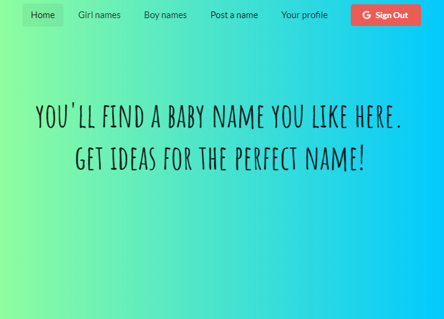

## Baby Names Ideas App 👶

I built this project in order to practice using HOC in React.

Need ideas for baby names? Look no further! Here you can find some beautiful names or even add your own.

#### Install & Start

    $ git clone https://github.com/orvalho/baby-names
    $ cd baby-names
    $ npm install
    $ npm start

#### App

#### Stack

-   React
-   React DOM
-   Redux
-   React Redux
-   React Router DOM
-   Redux Form
-   Redux Thunk
-   Google API client library (auth2)
-   Node SASS
-   Semantic UI
-   Redux DevTools extension
